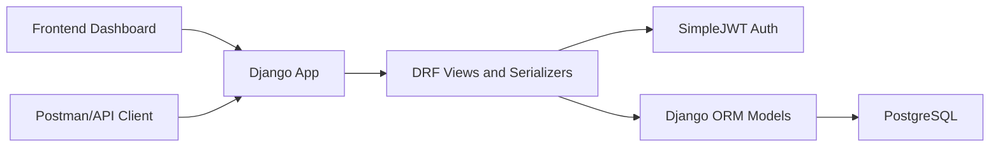
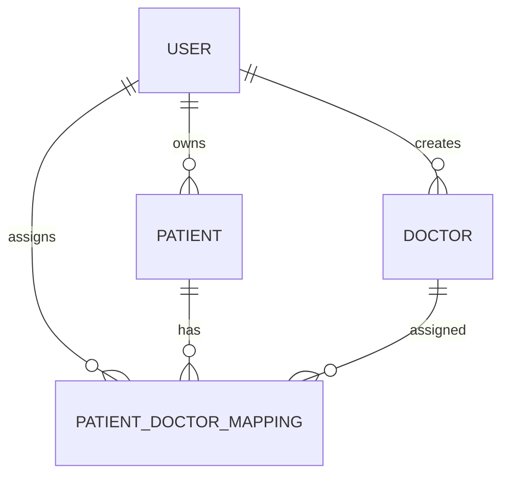

# Company Handoff README

## Project Overview

This project implements the requested healthcare backend using Django, Django REST Framework, PostgreSQL, and JWT authentication. A lightweight frontend dashboard is included so reviewers can exercise the API without Postman. The local setup uses a normal PostgreSQL installation and does not require Docker.

## Requirement Coverage

| Requirement | Implementation |
| --- | --- |
| Django and DRF backend | `config/` plus `apps/*` API apps |
| PostgreSQL database | `DATABASE_URL` in `.env`, local PostgreSQL setup |
| JWT authentication | `djangorestframework-simplejwt` in `apps.accounts` |
| User registration | `POST /api/auth/register/` |
| User login | `POST /api/auth/login/` |
| Patient CRUD | `apps.patients` |
| Doctor CRUD | `apps.doctors` |
| Patient-doctor mapping | `apps.mappings` |
| Django ORM | Models in each domain app |
| Validation and error handling | DRF serializers and generic API views |
| Environment variables | `django-environ`, `.env.example` |
| Frontend | Django template plus static CSS/JS at `/` |
| API docs | Swagger UI at `/api/docs/` |

## Architecture



## Domain Model



## Security Decisions

- The custom user model uses email as the login identifier.
- Patient records are private to the user who created them.
- Mapping records are visible only if the mapped patient belongs to the authenticated user.
- Doctor records are a shared authenticated catalog because the assignment requirement asks for retrieving all doctors.
- Duplicate patient-doctor assignments are blocked with a database-level unique constraint.
- Unavailable doctors cannot be assigned through the mapping serializer.

## Local Review Flow

```powershell
cd outputs/healthcare-backend
python -m venv .venv
.\.venv\Scripts\Activate.ps1
pip install -r requirements.txt
copy .env.example .env
psql -U postgres -c "CREATE DATABASE healthcare_db;"
psql -U postgres -c "CREATE USER healthcare_user WITH PASSWORD 'healthcare_password';"
psql -U postgres -c "GRANT ALL PRIVILEGES ON DATABASE healthcare_db TO healthcare_user;"
python manage.py migrate
python manage.py test
python manage.py runserver
```

Review URLs:

- Dashboard: `http://127.0.0.1:8000/`
- Swagger: `http://127.0.0.1:8000/api/docs/`
- Admin: `http://127.0.0.1:8000/admin/`

## Production Notes

Before production deployment:

- Replace `SECRET_KEY`.
- Set `DEBUG=False`.
- Use production-grade `ALLOWED_HOSTS`.
- Use managed PostgreSQL or a hardened Postgres host.
- Configure HTTPS and secure proxy headers.
- Store secrets in a secret manager or deployment environment variables.
- Add rate limiting for auth endpoints.
- Add audit trails for clinical record changes if the product requires compliance-grade history.
- Add role-based permissions if doctors, admins, and care coordinators need different access.

## Test Coverage

Current tests validate:

- Register and login success.
- Authenticated patient creation and listing.
- Patient privacy across users.
- Doctor endpoint authentication.
- Doctor creation validation normalization.
- Patient-doctor assignment.
- Prevention of assigning a doctor to another user's patient.
- `GET /api/mappings/<patient_id>/` behavior.

Run:

```powershell
python manage.py test
python manage.py check
```
